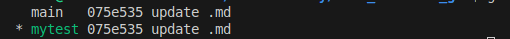
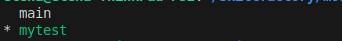
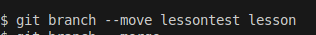
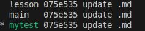

[<< к содержанию](./readme.md)

## git branch

**git branch** - управление ветками. 

Команда может выполняться с параметрами и без них, в заисимости от того какой результат требуется.

* Выполнение команды без параметров покажет список имеющихся веток:

```bash=
git branch
```

*Результат выполнения команды:*


##


### Параметры команды:

* ***[new_branch]*** - при создании новой ветки указать имя новой ветки

```bash=
git branch mytest
```

В данном примере создается <mark>новая ветка mytest<mark>


* ***-v***  -  просмотр последнего коммита

```bash=
git branch -v
```

В данном примере будет показан результат выполнения предыдущей команды. Будут показаны ветки которые были созданы ранее и <mark>новая ветка mytest<mark>

*Результат выполнения команды:*



* ***--merged***  просмотр веток, слитых с текущей веткой


```bash=
git branch --merged
```

*Результат выполнения команды:*     




* ***--move***  переименовать локальную ветку

```bash=
git branch --move local_branch_name new_branch_name
```

*Пример записи команды:*



*Результат выполнения команды:*



Команда переименовывет ветку <mark>lessontest -> lesson<mark>
