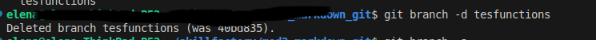

[<< к содержанию](./readme.md)

## git branch

**git branch** - управление ветками. 

Команда может выполняться с параметрами и без них, в заисимости от того какой результат требуется.

* Выполнение команды без параметров покажет список имеющихся веток:

```bash=
git branch
```

*Результат выполнения команды:*


##

В данном примере текущая ветка  ***mytest***. Она подсвечиватеся и помечается звездочкой.


### Параметры команды:

* ***[new_branch]*** - при создании новой ветки указать имя. Создается новая ветка с указанным именем. 


```bash=
git branch mytest
```

В данном примере создается <mark>новая ветка mytest<mark>

<br>

* ***-v***  -  просмотр последнего коммита

```bash=
git branch -v
```

В данном примере показаны ветки которые были созданы ранее и <mark>новая ветка mytest<mark>

*Результат выполнения команды:*


<br>

* ***--merged***  просмотр веток, слитых с текущей веткой


```bash=
git branch --merged
```

*Результат выполнения команды:*     


<br>

* ***--move***  переименовать локальную ветку


```bash=
git branch --move local_branch_name new_branch_name
```
   
*Пример записи команды:*


*Результат выполнения команды:*


Команда переименовывет ветку <mark>lessontest -> lesson<mark>  

<br>

* ***-d  [branch name]*** - этот параметр используется для удаления ветки. В командной строке необходимо указать имя ветки.

*Пример записи команды:*

```bash=
git branch -d [branch_name]

```

*Результат выполнения команды:*



<br>

**Примечание:** 

Для создания ветки можно также использовать команду ***get checkout -b[new branch name]***. При выполнении этой команды будет создана новая ветка и одновременно будет переключение в новую ветку. Смотри [checkout](./checkout.md).


