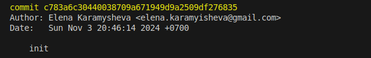

[<< к содержанию](./readme.md)

## git commit

**git commit** - создает слепок текущего состояния локального репозитория. Файлы, добавленные в индекс после выполнения команды [git add](./add.md), попадут в слепок. Каждый слепок получает свой идентификатор, который используется для отслеживания изменений в репозитории.

*Пример запуска команды:*

```bash=
git commit
```
<br>

После запуска этой команды, автоматически откроется текстовый редактор для ввода комментария к коммиту. Напишите коментарий, сохраните его и  состяние репозитория будет закомичено.

<br>

* Возможно написание комментария в теле команды, используя параметр ***-m***

```bash=
git commit -m "mytest.txt updated"
```

В данном примере указан коментарий ***"mytest.txt updated"***

<br>

* Если необходимо изменить комментарий к коммиту, можно использовать параметр ***--amend***. В этом случае комментарий будет изменен , но слепок остнется неизменный.

```bash=
git commit --amend
```
<br>

* Для просмотра статусов коммитов используйте команду [git log](./log.md)

```bash=
git log
```

*Вывод команды:*



