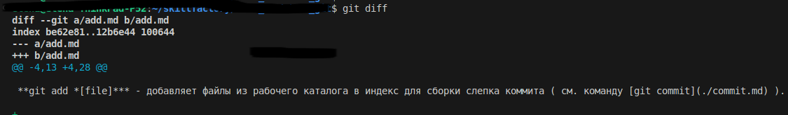
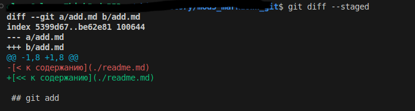

[<< к началу](./readme.md)

## git diff

**git diff** - команда выводит список измененных файлов  которые еще не были проиндексированы. В выводе команды представлена информация какие строки были изменены и сами изменения.

*Пример запуска команды:*

```bash=
git diff
```

<br>

*Результат выполнения команды:*




#### Параметры команды:

Многофункциональная команда ***git diff*** может быть использована для сравнения разных источников данных, в зависимти от выбранных атрибутов.

***--staged*** - используется для сравнения подверсионных файлов с локальным репозиторием (файлы последнего комита). 

```bash=
git diff --staged
``` 

*Результат выполнения команды:*




