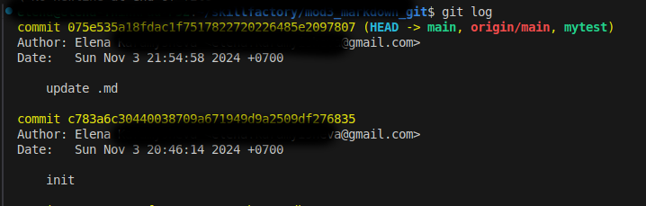
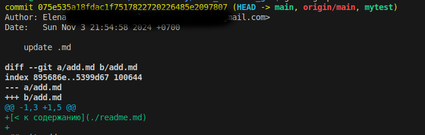
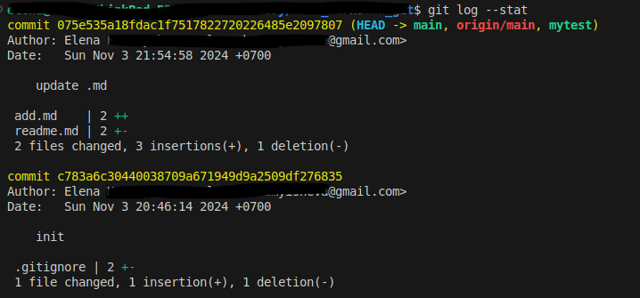
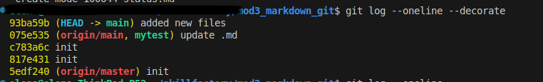

[<< к началу](./readme.md)

## git log

***git log*** - команда отображает историю коммитов. Все коммиты отображаются в обратном хронологическом порядке. Для фильтрации коммитов используется широкий набор параметров.

*Пример запуска команды:*

```bash=
git log
```

*Результат выполнения команды:*



<br>

#### Параметры команды:

<br>

* ***[-p]*** или ***[--patch]*** - показывает изменения внесенные каждым коммитом. 


```bash=
git log -p
```

*Результат выполнения команды:*



<br>


* ***--stat*** -  этот параметр используется если надо посмотреть статистику в сокращенном виде. В выводе команды будут показаны только измененные файлы для каждого коммита, без указания разницы между файлами в последнем и предыдущем коммитах.


```bash=
git log --stat
```


*Результат выполнения команды:*




<br>

* ***--oneline*** - краткое отображение коммита в одной строке. В результате выполнения команды с данным параметром будут показаны только идентификаторы коммитов и их комментарии. Используется для отображения краткой истории коммитов. Для просмотра указателей веток коммитов используйте флаг ***--decorate*** .


```bash=
git log --oneline --decorate
```

*Результат выполнения команды:*




