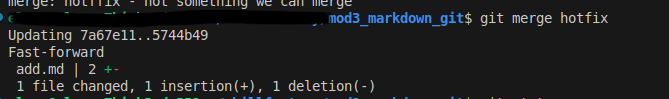

[<< к началу](./readme.md)

## git merge


**git merge ***[branch_name]***** - слияние ветки с текущей. Эта команда используется для слияния какой либо ветки с <mark>текущей</mark> веткой. 


```bash=
git merge [branch_name]
```

<br>

***<mark>ВАЖНО<mark>***

Перед слиянием выполните следующие команды:

1.  Убедитесь что вы находитесь именно в той ветке в которую надо интегрировать другую ветку. Для этого выполните проверку в какой ветке вы находитесь:


 ```bash=
   $ git status
  ```

Более подробно о команде рассказывается  [здесь](./status.md).

<br>

2. Если надо изменить текущую ветку, выполните команду **git checkout**. Ветка, указанная в этой команде будет принимающей веткой, таким образом все данные будут слиты в нее.

```bash=
git checkout branch_name
```


***branch_name*** - это имя ветки в котору вы переключаетесь. Более подробно о команде читайте [здесь](./checkout.md).

<br>

*Пример выполнения команды:*



В результате этого действия ветка hotfix сольется с текущей веткой.


