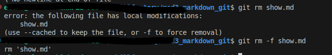

[<< к началу](./readme.md)

## git rm

**git rm ***[file_name]***** - команда удаляет файл из рабочего каталога и из индекса. 

<br>

*Пример запуска команды:*

```bash=
git rm [file_name]
```

*Результат выполнения команды:*



<br>

<mark>***Важно:***</mark>

Файлы не удаляются физически из каталога  и после удаления их можно восстановить при помощи команды:

```bash=
 git reset HEAD 
 ```
 
 
 а затем их можно снова добавить в индекс при помощи команды:
 
 ```bash=
 git add [file_name]
 ```

 Более подробно как работать с командой вы можете прочитать в [здесь](./add.md).

<br>

 #### Параметры команды:

 ***--dry-run***  - проверка удаления файлов. Файлы не будут удалены при использовании этого параметры. В выводе команды будет показаны фафлы , которые будут удалены.

 ```bash=
 git rm --dry-run [file_name]
 ```

<br>

 ***--cached*** - удаляет файл из индекса и оставляет нетронутыми файлы в рабочем каталоге.

 ```bash=
 git rm --cached [file_name]
 ```

 


