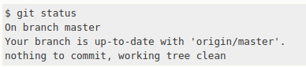
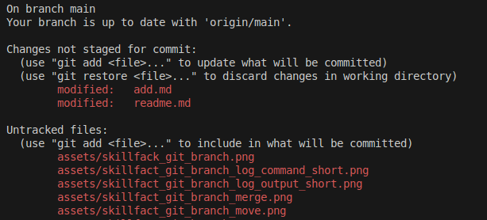
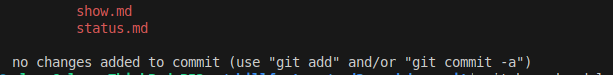

[<< к содержанию](./readme.md)

## git status

**git status** - показывает статус файлов в текущем каталоге и индексе.

Вывод этой команды покажет:
  * Статус файлов под версионным контролем, были ли они изменены со времени последнего коммита. 

  * Статус файлов не под версионным контролем, которые были созданы, но не добавлены в индекс.

  * Подсказки для изменения состояния файлов.


*Пример запуска команды*

  ```bash=
   $ git status
  ```

  *Результат выполнения команды, если не было никаких изменений*

  


  *Результат выполнения команды после внесения изменений в файлы в локальном репозитории

   
  


